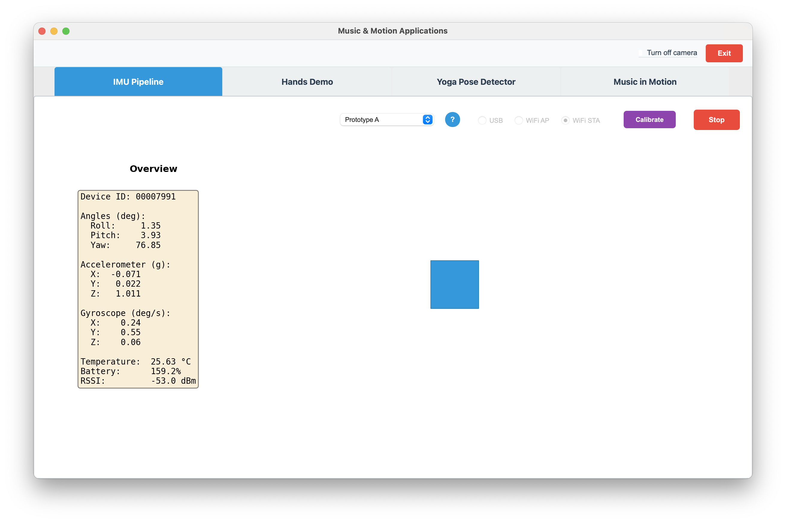

# Prototype A (Large IMU Movement)

← [IMU Pipeline](IMU-PIPELINE.md)



---

In the first prototype, IMU sensor data was used to enable the user to manipulate a blue box on the screen.  Two issues were discovered in building this prototype that had to be overcome.

## Stability

The IMU data tends to drift. To address this, a calibration step was added: whatever position the IMU is currently in is locked in as "zero-roll" and "zero-pitch".

This did 3 things:
- Removes dependency on how the user is wearing the IMU
- Compensates for small mounting angle differences
- Anchors control to the user's chosen posture

## Sensitivity

The IMUs are also very sensitive to the user's motions, leading to jerky motions and the blue box drifting quickly to the edge of the screen.  To address this, the prototype bounded the max roll and pitch to 45°.

This allowed exploration of how much physical movement maps to the full control space:
- Small tilts → fine control
- Large tilts → full-screen movement

This created a more stable system, but did introduce the need for calibration, which detracted from the goal of an immersive user experience.

## Algorithm: interpreting sensor data

The app reads **roll** and **pitch** (in degrees) from the IMU and maps them to a normalized on-screen position `(x, y)` in `[0, 1] × [0, 1]`. Center `(0.5, 0.5)` is “no movement”; full deflection in any direction reaches the screen edges.

**Step 1 — Calibration (one-time):**  
When the user clicks **Calibrate**, the current pose is stored as zero:

- `zero_roll` = current roll (degrees)  
- `zero_pitch` = current pitch (degrees)

All subsequent positions are computed **relative** to this pose.

**Step 2 — Relative angles:**  
Each frame, relative angles are computed from the current IMU reading:

```
roll_rel  = roll_deg  - zero_roll
pitch_rel = pitch_deg - zero_pitch
```

**Step 3 — Map to normalized position:**  
Full deflection is defined as ±45° from zero. So we divide by 45 and map to center ± 0.5:

- **X (left/right):** Roll positive (tilt right) → move right.  
  `x = 0.5 + (roll_rel / 45)`
- **Y (up/down):** Pitch positive (tilt forward) → move up on screen (inverted).  
  `y = 0.5 - (pitch_rel / 45)`

**Step 4 — Clamp to [0, 1]:**  
Final position is clamped so the box stays on screen:

```
x_pos = clamp(x, 0, 1)
y_pos = clamp(y, 0, 1)
```

**Summary:**  
- **Calibration:** current pose → zero_roll, zero_pitch.  
- **Mapping:** `x = 0.5 + (roll_deg - zero_roll) / 45`, `y = 0.5 - (pitch_deg - zero_pitch) / 45`, then clamp to `[0, 1]`.  
- **Constants:** full deflection = ±45° from calibrated zero; no explicit clamp on angle before mapping (overflow is handled by the final position clamp).
