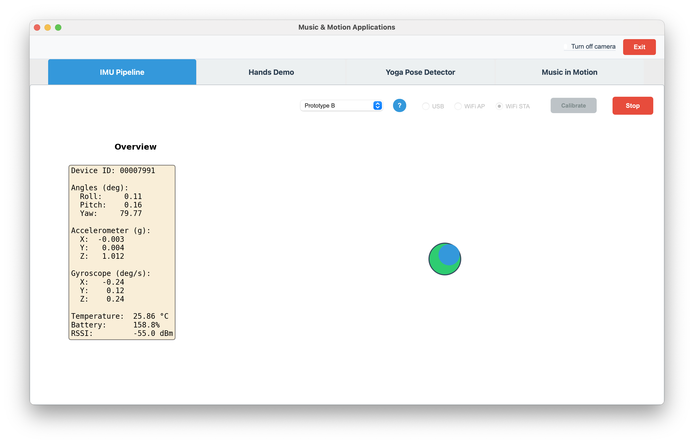

# Prototype B (Precise IMU Movement)

← [IMU Pipeline](IMU-PIPELINE.md)



---

This prototype explored an alternative approach that did not require calibration: the user could pick up the device and move without explicit setup. The key design choice was to **constrain the movement to ±5°**, which encouraged fine, controlled motion and made the system feel tight and reactive.

To simulate a task that demanded that level of control, Prototype B had the user move a blue dot into a center target. That also made it possible to explore how mapping design influences movement exploration. The result highlighted a design tension: optimizing for large motions (as in [Prototype A](IMU-PIPELINE-A.md)) versus small motions (Prototype B).

## Prototype A vs B (contrast)

| Aspect | Prototype A (Large IMU Movement) | Prototype B (Precise IMU Movement) |
|--------|----------------------------------|------------------------------------|
| **Calibration** | Required: user clicks “Calibrate” to set current pose as zero (zero_roll, zero_pitch). | None: device angles used directly. |
| **Tilt range** | ±45° from calibrated zero; full deflection = 45° relative. | ±5° absolute; tilt clamped to ±5° before mapping. |
| **Mapping input** | Relative angles: `roll_rel = roll_deg - zero_roll`, `pitch_rel = pitch_deg - zero_pitch`. | Raw angles: roll_deg, pitch_deg (clamped to ±5°). |
| **Position formula** | `x = 0.5 + roll_rel/45`, `y = 0.5 - pitch_rel/45`; then clamp (x, y) to [0, 1]. | `x = 0.5 + (clamp(roll, -5, 5)/5)*0.5`, `y = 0.5 - (clamp(pitch, -5, 5)/5)*0.5`; then clamp to [0, 1]. |
| **Stability** | Calibration removes drift and mounting variation; anchors to user’s chosen posture. | No calibration; tight ±5° range reduces sensitivity and avoids drift. |
| **Use case** | Large, exploratory motion; full-screen movement with big tilts. | Fine, controlled motion; “move blue dot into center target” task. |
| **Widget** | Blue **box** (`ImuBoxWidget`); calibrate button enabled. | Blue **dot/circle** in center target (`ImuSquareWidget`); no calibrate button. |

## Implementation overview

- **App:** `motion-app.py`. When the user selects **Prototype B** from the method dropdown, the main content shows the IMU stats panel and the Prototype B widget (`ImuSquareWidget`). The calibrate button is disabled; no zero-pose calibration is used.
- **Data flow:** Each timer tick (~30 Hz), the app reads the latest IMU sample (roll and pitch in degrees from the device). Those angles are passed to `map_tilt_to_position(roll_deg, pitch_deg)`; the returned normalized position `(x, y)` is stored and the widget is repainted. The same angles are stored for the “game” target logic (circle color).
- **Widget:** `ImuSquareWidget`: white background, a fixed target circle at the center, and a blue circle (the “square”) whose position is driven by the mapped tilt. The widget has a fixed minimum size (400×400) and uses PyQt5 for drawing.

## Tilt-to-position mapping (algorithm)

The mapping from IMU roll/pitch (degrees) to a normalized position `(x, y)` in `[0, 1] × [0, 1]` is done in `map_tilt_to_position`. Center `(0.5, 0.5)` corresponds to zero tilt.

**Step 1 — Clamp to ±MAX_TILT_DEG:**

```
roll  = clamp(roll_deg,  -MAX_TILT_DEG, +MAX_TILT_DEG)
pitch = clamp(pitch_deg, -MAX_TILT_DEG, +MAX_TILT_DEG)
```

with `MAX_TILT_DEG = 5.0`. So the effective range is ±5° for both axes.

**Step 2 — Normalize to [-1, 1]:**

```
roll_norm  = roll  / MAX_TILT_DEG   ∈ [-1, 1]
pitch_norm = pitch / MAX_TILT_DEG   ∈ [-1, 1]
```

**Step 3 — Map to normalized position [0, 1]:**

- **X (left/right):** Roll positive (tilt right) → move right (increase x).
  ```
  x = 0.5 + roll_norm * 0.5
  ```
  So roll = −5° → x = 0; roll = 0° → x = 0.5; roll = +5° → x = 1.

- **Y (up/down):** Pitch positive (tilt forward/nose down) → move **up** on screen (decrease y), so the mapping is inverted:
  ```
  y = 0.5 - pitch_norm * 0.5
  ```
  So pitch = −5° → y = 1 (top); pitch = 0° → y = 0.5; pitch = +5° → y = 0 (bottom).

**Summary formulae:**

- `x = 0.5 + (clamp(roll_deg, -5, 5) / 5) * 0.5`
- `y = 0.5 - (clamp(pitch_deg, -5, 5) / 5) * 0.5`

The returned `(x, y)` are clamped to `[0, 1]` when stored in `set_square_position`.

## Game mode: target circle

A circular target is drawn at the widget center with radius `TARGET_CIRCLE_RADIUS = 30` pixels. Its color depends on two conditions:

1. **Angle in target zone:** Current roll and pitch (device angles, not the mapped position) must both be within ±`TARGET_TOLERANCE_DEG` = **±0.3°** of level.
2. **Square inside circle:** The distance from the blue square’s center to the widget center must be ≤ 30 px.

If **both** are true, the circle is drawn **green** (#2ecc71); otherwise it is **gray** (#95a5a6). So the user “wins” when the device is nearly level and the blue dot has been moved into the center circle.

## Constants (summary)

| Constant | Value | Meaning |
|----------|--------|--------|
| `MAX_TILT_DEG` | 5.0 | Full deflection range ±5°; tilt is clamped to this before mapping. |
| `SQUARE_SIZE` | 40 | Diameter of the blue circle in pixels. |
| `TARGET_CIRCLE_RADIUS` | 30 | Radius of the center target circle in pixels. |
| `TARGET_TOLERANCE_DEG` | 0.3 | Roll and pitch must be within ±0.3° of level for the target zone to be “active.” |

## Relation to other prototypes

The same tilt-to-position mapping (and optionally the same widget style) is reused in later prototypes: Proto C (Pitch + Pan), Proto D (Pitch+Pan+Vol), Proto E (Dualing IMUs), Proto F (Pitch+Timbre), and Proto G (Equalizer) all use the same ±5° clamp and the same formulae for the **visual** position of the on-screen control (blue square or equivalent). Audio and other controls in those prototypes use their own mappings (e.g. wider roll range for pan, pitch for frequency).
