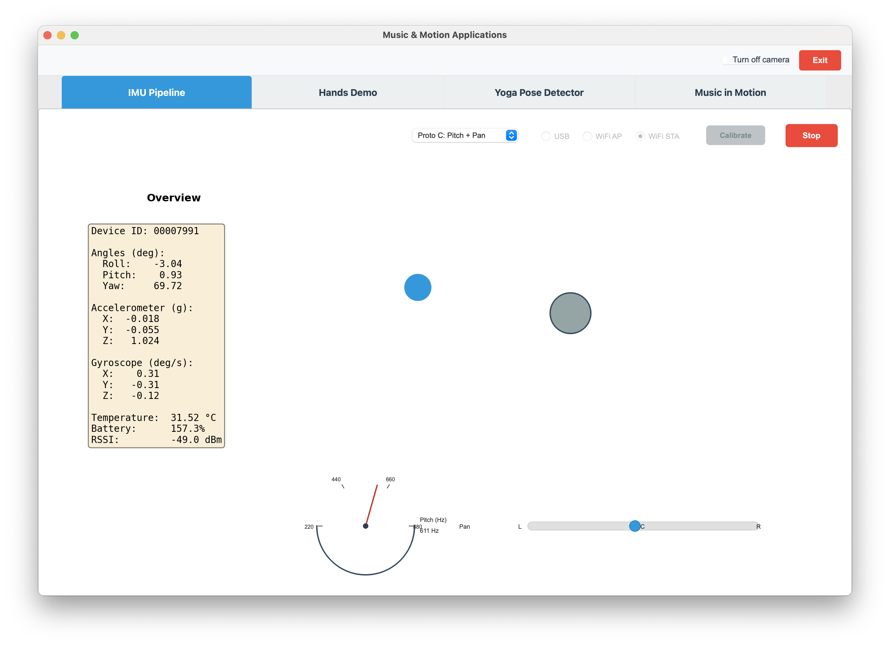

# Prototype C (Pitch & Pan)

← [IMU Pipeline](IMU-PIPELINE.md)



---

This prototype connects IMU sensor data to audio, starting with a simple tone. It maps IMU motion to **sound control** with two audio properties: **pitch** (frequency) and **pan** (stereo position). It combines the tight tilt range of [Prototype B](IMU-PIPELINE-B.md) for pitch with the wider range of [Prototype A](IMU-PIPELINE-A.md) for pan.

- **Pitch:** IMU pitch (forward/back tilt) → tone frequency. Fine-grained control uses the same ±5° technique as Prototype B.
- **Pan:** IMU roll (left/right tilt) → stereo left/right. Larger motion range is better for pan, so the technique from Prototype A is used (±45°).

## Design goals

- **Pitch:** Forward/back tilt drives the frequency of a single tone (220–880 Hz).
- **Pan:** Left/right tilt drives stereo position (full left to full right).
- **Visual:** Same as Prototype B — blue square driven by roll/pitch with ±5° tilt mapping.

## Pitch (IMU pitch angle → frequency)

**Input:** IMU pitch in degrees (forward/back tilt).  
**Constants:** `MAX_TILT_DEG = 5.0`, `BASE_FREQ = 220.0`, `MAX_FREQ = 880.0`.

- Clamp pitch to ±5°:
  ```
  pitch_clamped = clamp(pitch_deg, -5, +5)
  ```
- Map [-5, +5] → [0, 1]:
  ```
  norm = (pitch_clamped + 5) / 10
  ```
- Linear map to frequency (Hz):
  ```
  freq = 220 + 660 * norm
  ```

So: pitch = −5° → norm = 0 → freq = 220 Hz; pitch = 0° → norm = 0.5 → freq = 550 Hz; pitch = +5° → norm = 1 → freq = 880 Hz.

**Formula:** `freq = BASE_FREQ + (MAX_FREQ - BASE_FREQ) * (clamp(pitch_deg, -5, 5) + 5) / 10`

## Pan (IMU roll angle → stereo pan)

**Input:** IMU roll in degrees (left/right tilt).  
**Constant:** `MAX_ROLL_PAN_DEG = 45.0`.

- Clamp roll to ±45°; map to pan in [-1, +1] (−1 = full left, +1 = full right):
  ```
  roll_clamped = clamp(roll_deg, -45, +45)
  pan = roll_clamped / 45
  ```
- The tone is generated in mono, then panned with equal-power gains:
  ```
  left_gain  = sqrt((1 - pan) / 2)
  right_gain = sqrt((1 + pan) / 2)
  ```

So: pan = −1 → left_gain = 1, right_gain = 0; pan = 0 → left_gain = right_gain = 1/√2; pan = +1 → left_gain = 0, right_gain = 1.

**Formula:** `pan = clamp(roll_deg, -45, 45) / 45`; stereo: `left = mono * sqrt((1 - pan)/2)`, `right = mono * sqrt((1 + pan)/2)`.

## Summary

- **Pitch:** freq = 220 + 660 * (clamp(pitch_deg, -5, 5) + 5) / 10
- **Pan:** pan = clamp(roll_deg, -45, 45) / 45
- **Stereo:** left = mono * sqrt((1 - pan)/2), right = mono * sqrt((1 + pan)/2)
