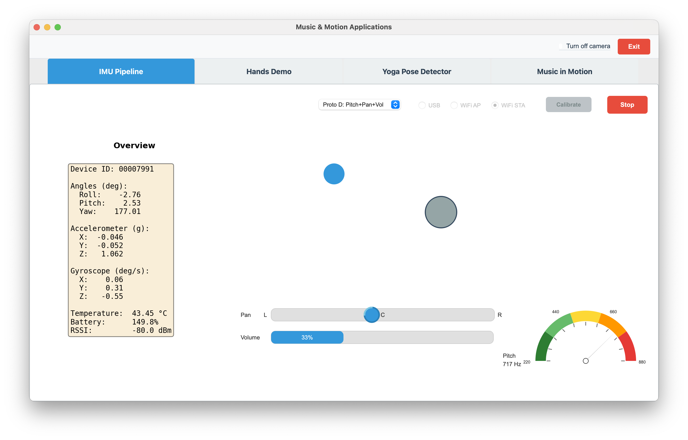

# Prototype D (Pitch & Pan & Volume)

← [IMU Pipeline](IMU-PIPELINE.md)

---

This prototype builds on [Prototype C](IMU-PIPELINE-C.md) (Pitch & Pan) by adding **volume** control driven by Z-axis acceleration. Pitch and pan behave the same as in C; loudness is the new dimension.

## Design goals

- **Visual:** Same as Prototype B / C — blue square driven by roll/pitch with ±5° tilt mapping.
- **Pitch:** Same as C — IMU pitch (forward/back tilt) maps to tone frequency (220–880 Hz, ±5°).
- **Pan:** Same as C — IMU roll (left/right tilt) maps to stereo pan (±45° → full left/right), equal-power panning.
- **Loudness:** Z-axis acceleration (vertical g) controls volume via discrete steps, with cooldown to avoid runaway changes.
- **UI:** Pitch dial, pan bar, and volume bar at the bottom; click the volume bar to set volume directly (and clear cooldown).

## Pitch and pan

Pitch and pan use the same formulas as [Prototype C](IMU-PIPELINE-C.md): pitch → frequency (220 + 660 * norm over ±5°), roll → pan (clamp(roll, -45, 45) / 45) with equal-power stereo gains.

## Loudness (Z-accel → volume)

Volume is **not** continuous with g; it changes in **discrete steps** based on Z-axis acceleration:

- **Z-accel > 1.2 g** (device tilted back / "up") → volume **up** by one step (10% of range).
- **Z-accel < 0.8 g** (device tilted forward / "down") → volume **down** by one step.
- After each volume change, a **2 s cooldown** applies before the next accel-based change (avoids runaway volume from holding a pose).
- Volume is clamped between 2% and 25% of the oscillator’s max amplitude (`AMP_MIN` / `AMP_MAX`).

Clicking on the volume bar sets volume directly and clears the cooldown so the next tilt-based step can happen right away.

## UI

- **Center:** Blue square (roll/pitch, ±5°) as in Prototype B/C.
- **Bottom:** Pitch dial (right), Pan and Volume bars (left, stacked); click the volume bar to set volume directly.
