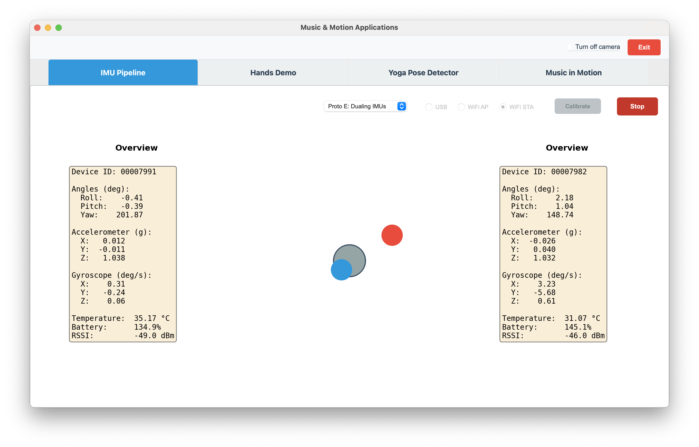

# Prototype E (Dueling IMUs)

← [IMU Pipeline](IMU-PIPELINE.md)

---

Prototype E extends the **Precise IMU Movement** idea from [Prototype B](IMU-PIPELINE-B.md) to **two IMUs at once**: one drives a blue circle, the other a red circle, on the same canvas. Both use the same ±5° tilt mapping as Prototype B, so the feel is tight and reactive. This lets you explore how two people (or two limbs) can share the same visual space with separate sensors.

## Design goals

- **Dual IMU input:** First IMU → blue circle; second IMU → red circle.
- **Same mapping as Prototype B:** Roll and pitch are clamped to ±5° and mapped to normalized position (0–1); center = (0.5, 0.5).
- **No audio:** Visual only (two moving circles).
- **Game mode (blue only):** A target circle at the center turns **green** when (1) the blue IMU’s roll and pitch are within ±0.3° of level *and* (2) the blue circle is inside the target circle. Otherwise the target is gray.

## Wi-Fi STA mode (required for two IMUs)

Prototype E requires the IMUs to be used in **Wi-Fi STA (station) mode**. In this setup, each IMU connects to your local network and **broadcasts its data on a different port**. The Python app listens on both ports and reads the transmitted data from each device. You configure the first device’s port as `port` and the second as `port2` in `.imuconfig`; the app then opens connections to both and polls each for samples. With a single USB connection you can only attach one IMU, so dual-IMU operation is done over the network via STA mode.

## Configuration

- **First IMU:** Uses the same port as other prototypes — in STA mode, set `port` in the `wifi` section of `.imuconfig` to the port this device is broadcasting on.
- **Second IMU:** The app reads `port2` from the `wifi` section and starts a second `WifiImuReader` on that port. If `port2` is missing or the second reader fails to start, the red circle is not updated and the second stats panel shows a waiting state.

So for two IMUs you run both devices in Wi-Fi STA mode (each broadcasting on the local network on its own port) and set `port` and `port2` in `.imuconfig` to those two ports.

## Tilt mapping (same as Prototype B)

For each IMU, roll and pitch in degrees are mapped to a normalized position:

- **Clamp:** `roll`, `pitch` ∈ [−5, +5]° (`MAX_TILT_DEG = 5.0`).
- **Normalize:** `roll_norm = roll / 5`, `pitch_norm = pitch / 5` in [−1, 1].
- **Position:**  
  `x = 0.5 + roll_norm * 0.5`  
  `y = 0.5 - pitch_norm * 0.5`  

So tilt left → x decreases; tilt right → x increases; tilt forward (nose down) → y decreases (dot moves up); tilt back → y increases (dot moves down). Full ±5° tilt moves the circle from center to the edge of the play area.

## UI layout

- **Left:** IMU 1 stats (roll, pitch, yaw, accel, etc.) for the blue circle.
- **Center:** Dual-square widget — white background, gray target circle at center (radius 30 px), blue circle (IMU 1), red circle (IMU 2). Both circles are 40 px; positions are derived from each IMU’s roll/pitch.
- **Right:** IMU 2 stats for the red circle (visible only in Proto E). If the second IMU is not connected, this panel shows that it is waiting.

Calibration is disabled when Prototype E is selected. When you switch to Proto E, both circles are reset to the center.

## Implementation notes

- **Widget:** `ImuDualSquareWidget` in `motion-app.py` — holds blue/red normalized positions and blue roll/pitch for target logic; uses `map_tilt_to_position(roll_deg, pitch_deg)` (same as Prototype B’s square).
- **Polling:** Main IMU is polled as usual; when the method is Proto E, a second reader (`imu_reader2`) is started on `port2` (Wi-Fi STA only) and polled each tick; blue position from IMU 1, red position from IMU 2, with angles for the blue square used for the target circle (green when level and inside the circle).
