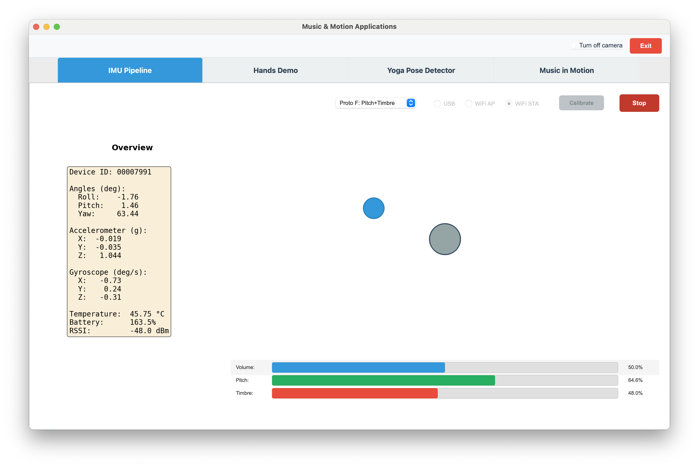

# Prototype F (Pitch & Pan & Timbre)

← [IMU Pipeline](IMU-PIPELINE.md)



---

Prototype F extends the Pitch + Pan idea by adding **timbre** control and moving **pan** to yaw (rotation) so that roll can drive timbre. The result: pitch → frequency, **yaw** → stereo pan, **roll** → timbre (waveform shape).

**What it does (summary):**
- **Pitch** (IMU pitch, forward/back tilt): maps to tone frequency (220–880 Hz, ±5°), same as Prototype C.
- **Pan** (IMU **yaw**, rotation 0–360°): maps to stereo position (0° = left, 180° = center, 360° = right). So you rotate the device to move the sound left/right.
- **Timbre** (IMU **roll**, left/right tilt): maps to a blend between **sine** (warm) and **sawtooth** (bright). Roll left → more sine; roll right → more sawtooth.
- **Volume:** user-controlled only (clickable volume bar), no motion control.

## Implementation of Timbre (roll → waveform)

Timbre is controlled only by **roll** over ±45°. There are no separate EQ bands; the tone is a single oscillator whose **waveform** morphs between sine and sawtooth.

### 1. Roll → normalized timbre `[0, 1]`

Constant: `MAX_ROLL_TIMBRE_DEG = 45.0`.

- Clamp roll to ±45°:
  ```
  roll_clamped = clamp(roll_deg, -45, +45)
  ```
- Map `[-45°, +45°]` → `[0, 1]`:
  ```
  timbre_norm = (roll_clamped + 45) / 90
  ```
So: roll = −45° → timbre_norm = 0 (full left); roll = 0° → 0.5; roll = +45° → 1 (full right).

**Formula:** `timbre_norm = (clamp(roll_deg, -45, 45) + 45) / 90`

### 2. Timbre → waveform (sine vs sawtooth)

The oscillator is a blend of two waveforms:
- **Sine:** `sine_wave = sin(phases)`
- **Sawtooth:** `sawtooth_wave = 2 * (phases / (2π) mod 1) - 1`

**Blend:**
```
mono = (1 - timbre_norm) * sine_wave + timbre_norm * sawtooth_wave
```
So:
- timbre_norm = 0 (roll left) → 100% sine (warm)
- timbre_norm = 0.5 (roll center) → 50% sine, 50% sawtooth
- timbre_norm = 1 (roll right) → 100% sawtooth (bright)

### Summary (formulas)

| Step | Formula |
|------|--------|
| Roll → timbre | `timbre_norm = (clamp(roll_deg, -45, 45) + 45) / 90` |
| Waveform | `mono = (1 - timbre_norm) * sin(φ) + timbre_norm * sawtooth(φ)` |

The UI shows three read-only bars: Volume (user-set), Pitch (IMU), and Timbre (IMU). The blue square and target circle use the same ±5° roll/pitch mapping as Prototype B for the visual.
