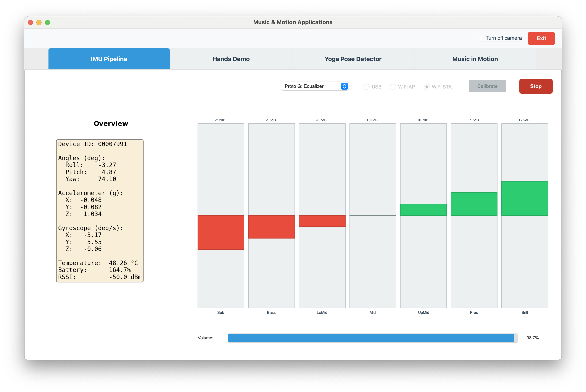

# Prototype G (Music Control)

← [IMU Pipeline](IMU-PIPELINE.md)




---

Up until now, control of audio was limited to a monotone sound, and timbre was limited to a simple warm/bright distinction.

Prototype G addressed a few design goals:
- Instead of playing a tone, play a looping audio file (e.g. `music/music.mp3`), moving closer to the goal of using body motion to shape music.
- Enrich timbre control by allowing the user to control **7 equalizer bands** using **IMU roll** (left/right tilt).
- Volume can be controlled by **IMU pitch**
- **IMU yaw** can be mapped to pan but the current implementation outputs mono to both channels.


## Implementation of Equalizer (New)

In Prototype G, the equalizer is a **7-band tilt EQ** driven by **IMU roll** over ±10°: tilt left = bright (lows down, highs up), tilt right = warm (lows up, highs down), with tanh softening and per-band smoothing.

- **Control:** Roll angle only.
- **Input:** Roll in degrees (device tilted left or right).
- **Range:** Roll is clamped to ±10° (`MAX_ROLL_TIMBRE_DEG = 10.0`).
- **Effect:** One tilt control for the whole spectrum (lows vs highs), not separate knobs per band.


## Tilt behavior

- **Roll = 0°** → flat: all 7 bands at 0 dB.
- **Roll < 0** (tilt left) → lows cut, highs boosted → thinner, brighter.
- **Roll > 0** (tilt right) → lows boosted, highs cut → warmer, bassier.

So the EQ is a single **tilt** (slope) over frequency, controlled by roll.

## How the gains are computed

**1. Clamp roll:**

```
roll_clamped = clamp(roll_deg, -10, +10)
```

**2. Normalize and soften:**

```
raw_norm = roll_clamped / 10   # in [-1, 1]
tilt_norm = tanh(raw_norm * 1.2)
```

The tanh softens the ends so full tilt isn't too extreme.

**3. Per-band gain (tilt EQ):**

The 7 bands are treated as positions from low (band 0) to high (band 6). For each band index `i`:

```
band_pos = (i - 3) / 3   # about -1 for lowest band, +1 for highest
gain_db[i] = MAX_GAIN_DB * (-tilt_norm) * band_pos
```

with `MAX_GAIN_DB = 6.0`.

- **Left tilt** (negative roll → negative tilt_norm) → negative gain_db for low bands, positive for high bands → lows down, highs up.
- **Right tilt** (positive roll → positive tilt_norm) → positive gain_db for low bands, negative for high bands → lows up, highs down.

## 7 bands (Hz)

| Band | Range (Hz) |
|------|------------|
| 0    | 20–60      |
| 1    | 60–250     |
| 2    | 250–500    |
| 3    | 500–2000   |
| 4    | 2000–4000  |
| 5    | 4000–6000  |
| 6    | 6000–20000 |

## How it's applied to the audio

- Each block is FFT'd; each FFT bin is assigned to one of the 7 bands via `band_index`.   
  
- The gain for that band (in dB) is converted to linear and multiplied onto the bin.  
  
- **Smoothing:** Raw band gains are smoothed over time:
  ```
  smoothed = 0.15 * raw + 0.85 * previous_smoothed
  ```

  so the EQ doesn't jump.  
  
- After iFFT, a soft limiter (and then hard clip at ±1) avoids clipping.
