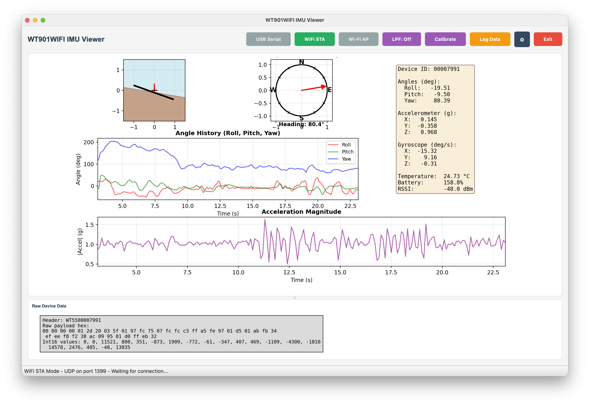

# IMU Viewer

← [Music In Motion](MUSIC-MOTION.md)




The **IMU Viewer** is a standalone desktop app for viewing live data from WitMotion WT901WIFI IMU devices. It is used to verify that the device is connected and streaming, inspect raw sensor values and orientation angles, and optionally log data to CSV. It does not control audio or the main Music in Motion app; it is a diagnostic and visualization tool for the IMU hardware and protocol.


To  start the app:

```bash
python -m imu_viewer.app
```

Or:

```bash
python imu_viewer/app.py
```

Use `--usb`, `--sta`, or `--ap` to force connection mode; use `--list-ports` to see available serial ports. Use ``python -m imu_viewer.app`` for all commands, or refer to the README file in the imu_viewer folder.


## Purpose

- **Verify connectivity** — Confirm that the IMU is reachable over USB serial or Wi‑Fi and that frames are being received and decoded.
- **Inspect sensor data** — See real-time accelerometer, gyroscope, magnetometer, and derived orientation (roll, pitch, yaw) in numeric form and as simple visualizations.
- **Support development** — Debug the WT55 protocol, check calibration, and capture sample data (e.g. via CSV logging) for use in the main motion app or analysis.

## How it works (high level)

1. **Configuration** — On startup, the app reads `.imuconfig` in the project root (or current working directory) for defaults: connection mode (USB, Wi‑Fi STA, or Wi‑Fi AP), serial port, baud rate, and Wi‑Fi settings (SSID, password, port). Command-line flags can override the mode and other options.

2. **Data source** — Depending on mode, the app uses one of three readers:
   - **USB Serial** — Direct connection to the IMU over a serial port (e.g. `/dev/tty.usbserial-10`). Frames are read from the serial stream and decoded.
   - **Wi‑Fi STA (Station)** — The IMU connects to your local network; the app runs a TCP or UDP server and the device sends frames to it. Used when the IMU is in STA mode and you want to view data over the network.
   - **Wi‑Fi AP (Access Point)** — The IMU acts as an access point; the app connects to the device’s IP and port and receives frames. Used when the IMU is in AP mode.

3. **Protocol** — Each reader expects **WT55 protocol** frames from the WT901WIFI (e.g. 54-byte frames with header, device ID, timestamp, raw sensor and angle values). Frames are decoded into a common **ImuSample** (accelerometer in g, gyro in deg/s, magnetometer, roll/pitch/yaw in degrees, temperature, battery, etc.).

4. **UI** — A timer (or similar) polls the active data source for the latest sample. The main window updates:
   - **Numeric readouts** — Current values for all channels.
   - **Artificial horizon** — Roll and pitch shown as a simple horizon indicator.
   - **Compass** — Heading from yaw.
   - **Time-series plots** — Recent history of angles and/or acceleration for a short window (e.g. 20 seconds).

5. **Optional CSV logging** — If `--log FILE` is given, each received sample is appended to a CSV file with timestamp and all decoded fields, for later analysis or playback.

6. **Calibration** — The viewer can optionally “zero” the current pose (set current roll/pitch/yaw as the reference) so displayed angles are relative to that pose, similar to calibration in the main motion app.

End-to-end: **IMU device → serial or network → reader decodes WT55 → ImuSample → UI and optional CSV.**


## Relation to the main app

The main application (`motion-app.py`) also uses WT901WIFI IMUs for the IMU Pipeline prototypes (e.g. roll/pitch/yaw for the equalizer, dual-IMU mode). It reuses the same protocol and reader concepts (e.g. `imu_viewer`’s data sources or similar logic). The IMU Viewer is a separate, focused tool for checking that the hardware and protocol work before or while using the main app.
