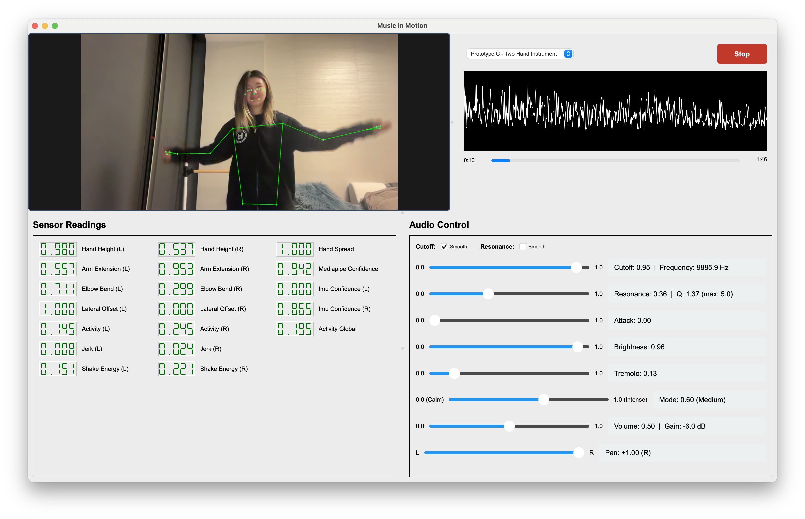

# Music in Motion

← [Music in Motion](MUSIC-MOTION.md)




These pages document the prototypes built as part of the Final Optimized Design.  

To start the app:

```bash
python mmotion.py
```

This final design builds on the **three-layer architecture** introduced in the [Sensor Fusion Pipeline](SF-PIPELINE.md): Motion → Control → DSP.  To map motion sensor data to audio control, 3 variations were designed.

## The prototypes

- **Prototype A** — [Air DJ](MM-PIPELINE-A.md).  Turn the user into a DJ in the air. 
   - 🖐 Left Hand Height — Tone & Space
   - 🖐 Right Hand Height — Energy & Aggression
   - Spread = Stereo
- **Prototype B** — [Calm vs Intense Mode Performer](MM-PIPELINE-B.md).  Whole body posture controls emotional state. Hands control details.
   - 🧍 Full Body Posture → Mode
   - 🖐 Hands → Expression
- **Prototype C** — [Two-Hand Instrument](MM-PIPELINE-C.md).  Each hand has a distinct musical role: Left = Tone, Right = Rhythm
   - 🖐 Left Hand (Tone Control)
     - Height → Cutoff
     - Elbow Bend → Resonance (Bent arm → mellow, Extended → sharp peak)
     - Lateral Offset → Pan (left hand left/right pans left/right)
   - 🖐 Right Hand (Rhythm & Motion)
     - Shake Energy → Tremolo Depth
     - Jerk → Attack
     - Activity_R → Volume boost (temporary)   

    

---

## Architectural framing

The SF-PIPELINE established:

1. **Motion Layer** — MediaPipe pose + dual IMUs → MotionFeatureExtractor → **MotionState**
2. **Control Layer** — **TimbreControls** (normalized 0–1), atomic snapshot for thread safety
3. **DSP Layer** — Biquad low-pass, resonance, tremolo, volume (and optional modulation)

Music in Motion keeps this three-layer split and extends it with the full fused sensor state (19 variables) and the complete timbre control vector (five timbre dimensions plus volume, mode, and pan). The app is the integrated “sensor-to-music” build that ties together the fusion pipeline and the timbre-control prototypes.

**Data flow:**

Camera + Dual IMUs → MotionFeatureExtractor → MotionState (19 vars) → mapping → TimbreControls → atomic snapshot → DSP → Audio

---

## Motion Layer: Fused sensor state (19 variables)

The fused pipeline in `motion_fusion.py` produces a single **MotionState** with all values normalized in [0, 1] (or [0, 1] for dynamics/confidence). The 19 variables are:

### Pose (9) — MediaPipe-derived

| Variable | Description |
|----------|-------------|
| `hand_height_L` | Left hand height relative to torso (normalized). |
| `hand_height_R` | Right hand height relative to torso (normalized). |
| `arm_extension_L` | Left arm extension (shoulder–wrist). |
| `arm_extension_R` | Right arm extension (shoulder–wrist). |
| `elbow_bend_L` | Left elbow bend (shoulder–elbow–wrist). |
| `elbow_bend_R` | Right elbow bend (shoulder–elbow–wrist). |
| `hand_spread` | Horizontal spread between left and right wrists (relative to shoulder width). |
| `lateral_offset_L` | Left wrist lateral offset from torso center. **Normalization:** 0 = left, 0.5 = center, 1 = right (signed: `dx = wrist.x - torso_center`, then mapped to [0, 1]). |
| `lateral_offset_R` | Right wrist lateral offset from torso center. Same normalization: 0 = left, 0.5 = center, 1 = right. |

### Dynamics (7) — IMU-derived

| Variable | Description |
|----------|-------------|
| `activity_L` | Left IMU activity (accel + gyro magnitude, smoothed). |
| `activity_R` | Right IMU activity (accel + gyro magnitude, smoothed). |
| `activity_global` | Global activity (average of left and right). |
| `jerk_L` | Left IMU jerk (rate of change of acceleration). |
| `jerk_R` | Right IMU jerk (rate of change of acceleration). |
| `shake_energy_L` | Left IMU shake energy (bandpass-filtered accel). |
| `shake_energy_R` | Right IMU shake energy (bandpass-filtered accel). |

### Confidence (3)

| Variable | Description |
|----------|-------------|
| `mediapipe_confidence` | Confidence of the MediaPipe pose solution. |
| `imu_confidence_L` | Left IMU data freshness/confidence. |
| `imu_confidence_R` | Right IMU data freshness/confidence. |

Pose and dynamics are smoothed and (where applicable) confidence-weighted before being written into MotionState. The audio and UI threads read from this single normalized state.

---

## Control Layer: Timbre controls + volume (+ mode, pan)

The control vector is the **TimbreControls** dataclass: all values normalized 0–1, with an atomic snapshot used by the audio callback so the UI and sensors can update controls without race conditions.

### Five timbre dimensions

| Control | Role |
|---------|------|
| **V_cutoff** | Low-pass cutoff (log-mapped to ~250–12000 Hz). |
| **V_resonance** | Resonance / Q intensity. |
| **V_attack** | Transient energy / “spikiness”. |
| **V_brightness** | Brightness macro. |
| **V_tremolo** | Tremolo depth. |

### Volume

| Control | Role |
|---------|------|
| **V_volume** | Output loudness (0–1, perceptually mapped). |

### Mode and pan

| Control | Role |
|---------|------|
| **V_mode** | Calm (0) vs intense (1); affects e.g. tremolo rate and Q range. |
| **V_pan** | Stereo pan (0.5 = center), mapped to equal-power L/R. |

So in total: **five timbre controls + volume + mode + pan** (eight dimensions in TimbreControls). Sliders (and optional sensor mapping) write into TimbreControls; the audio thread reads only from the snapshot.

---

## DSP Layer

The DSP layer is the same core as in the Sensor Fusion prototypes (see [SF-PIPELINE](SF-PIPELINE.md) and [SF-PIPELINE-B](SF-PIPELINE-B.md), [SF-PIPELINE-C](SF-PIPELINE-C.md)). In `mmotion.py`, `_apply_timbre_controls()` converts the 8 control values into filter coefficients and gains; the audio callback then applies filter → tremolo → volume in the sample loop, and pan when writing stereo output.

### DSP implementation of each control (mmotion.py)

| Control | DSP manipulation |
|---------|-------------------|
| **V_cutoff** | **Low-pass cutoff (Hz).** Log-mapped: `cutoff_hz = exp(lerp(log(250), log(12000), V_cutoff))` (250 Hz = dark, 12 kHz = bright). This cutoff is then multiplied by the brightness macro `2^(0.35*b)` (see V_brightness). Smoothed asymmetrically (8 ms attack, 40 ms release) to avoid zipper noise. The result drives the **biquad low-pass** (RBJ Cookbook) coefficient calculation. |
| **V_resonance** | **Filter Q (resonance peak).** `Q = lerp(Q_min, Q_max, V_resonance^1.8)` with Q_min = 0.7; Q_max is 5.0 (calm) or 10.0 (intense) depending on **V_mode**. Q is then scaled by the attack macro `(1 + 0.5*V_attack)` and by the brightness macro `2^(0.10*b)`, then clamped to [Q_min, Q_max]. Optionally smoothed (20 ms). The final Q is used in the same biquad low-pass as V_cutoff. |
| **V_attack** | **Transient “spikiness” via resonance.** No separate filter; V_attack scales the **Q** value: `Q *= 1.0 + 0.5*V_attack`. Higher attack → higher Q → sharper filter peak → more pronounced transients. |
| **V_brightness** | **Macro affecting cutoff and Q.** `b = (V_brightness - 0.5)*2` in [-1, +1]. Cutoff is multiplied by `2^(0.35*b)`; Q is multiplied by `2^(0.10*b)`. So brightness pushes both cutoff and resonance up or down together (0.5 = neutral). |
| **V_tremolo** | **Amplitude modulation (LFO).** Depth = `V_tremolo * 0.8` (0–0.8). Per sample: LFO = sin(phase), `gain = 1 - (depth * (1 + LFO) / 2)`; sample is multiplied by gain. **Rate** depends on V_mode when tremolo is active: calm (V_mode &lt; 0.4) → 1–4 Hz; intense → 1–8 Hz (rate also scales with V_tremolo). |
| **V_volume** | **Output gain (linear).** Perceptual curve: `gain_db = lerp(-30 dB, 0 dB, V_volume^0.32)` so 50% slider ≈ −6 dB. Converted to linear gain; smoothed asymmetrically (50 ms attack, 300 ms release). Each sample is multiplied by this gain after filter and tremolo. |
| **V_mode** | **Modulates other DSP (no direct per-sample effect).** Chooses Q_max for resonance (calm: 5, intense: 10) and tremolo LFO rate range (calm: 1–4 Hz, intense: 1–8 Hz). |
| **V_pan** | **Stereo balance (equal-power).** `pan = (V_pan - 0.5)*2` in [-1, +1]. `left_gain = sqrt((1 - pan)/2)`, `right_gain = sqrt((1 + pan)/2)`. Mono processed signal is copied to both output channels with these gains. |

**Signal flow (per sample):**  
Source sample → **Biquad LPF** (V_cutoff, V_resonance, V_attack, V_brightness, V_mode) → **Tremolo** (V_tremolo, V_mode) → **Volume** (V_volume) → **Pan** (V_pan) → stereo out.

For a description of the UI layout of the app, see [MM-APP-LAYOUT](MM-APP-LAYOUT.md).

---

## Sensor to Control Mapping

**UI behavior:** For each of the 3 prototypes, the six motion-driven controls (cutoff, resonance, pan, volume, tremolo, brightness) **self-adjust** every frame from sensor data. Sliders stay enabled and are updated so they visually follow the user’s motion; the same values are written into `TimbreControls` and the atomic snapshot so the audio reflects the same state.

---

## Audio control mapping by prototype (mmotion.py)

How each of the 8 audio controls is driven for the three prototypes. “Slider” = value comes from the UI sliders (user-adjusted); “fixed” = constant for that prototype.

| Control | Prototype A (Air DJ) | Prototype B (Calm vs Intense) | Prototype C (Two-Hand Instrument) |
|---------|----------------------|-------------------------------|-----------------------------------|
| **V_cutoff** | `hand_height_R` | `hand_height_R` | `hand_height_L` |
| **V_resonance** | `hand_height_L` | `jerk_L`, `jerk_R` (burst envelope) | `elbow_bend_L` (inverted) |
| **V_attack** | Slider | `arm_extension_L` | `jerk_R` (burst envelope) |
| **V_brightness** | `hand_spread` | `hand_height_R` (curve) | 0.2 + 0.8×cutoff (derived) |
| **V_tremolo** | `shake_energy_R` + `hand_spread` | Slider | `shake_energy_R` |
| **V_volume** | `activity_global` | `activity_global` | `activity_R` |
| **V_mode** | Slider | `hand_spread` (hysteresis) | Fixed (e.g. 0.6) |
| **V_pan** | `lateral_offset_L`, `lateral_offset_R` | Slider | `lateral_offset_L` |
