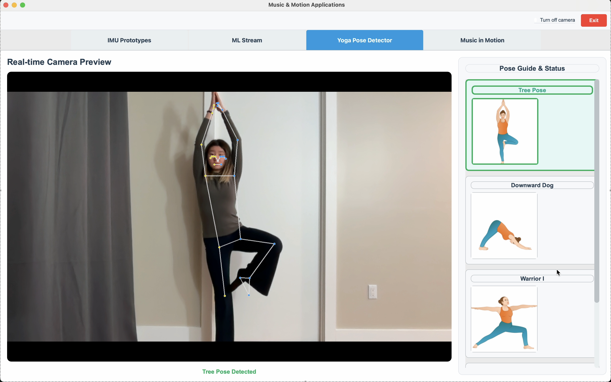

# Prototype B: Yoga Pose Detector

← [MP Pipeline](MP-PIPELINE.md)

---

Real-time **yoga pose detection** using MediaPipe **Pose**. Part of the [Vision-only design](MP-PIPELINE.md).

## App overview

The Yoga Pose Detector tab provides:

- **Live camera feed** with the MediaPipe pose skeleton overlaid.
- **Side panel** of pose cards (Tree, Downward Dog, Warrior I, Side Angle) with optional preview images.
- **Real-time classification**: each frame is checked against the four poses in order; the first match is shown.
- **Auto-scroll** to the detected pose card and status text (`“No pose detected”` or `"<Pose name> Detected"`).

Implementation: `music-motion/ui/tabs/yoga_pose.py` (UI) and `music-motion/ml/yoga.py` (detection logic).

## MediaPipe Pose setup

The tab uses `mp.solutions.pose.Pose` with:

- `static_image_mode=False`
- `model_complexity=1`
- `smooth_landmarks=True`
- `min_detection_confidence=0.5`, `min_tracking_confidence=0.5`

Landmarks are normalized image coordinates (0–1; y increases downward). Detection uses 2D (x, y) and angles derived from hip, knee, ankle, shoulder, elbow, and wrist landmarks.

## Derived data from Pose (our pipeline)

We compute the following from MediaPipe Pose landmarks (normalized to `[0, 1]` where applicable). These are not raw MediaPipe outputs.

| Data | Description |
|------|-------------|
| **hand_height_L / hand_height_R** | Wrist height relative to torso: 0 ≈ at hip, 1 ≈ at shoulder/head. From wrist y vs hip–shoulder range. |
| **arm_extension_L / arm_extension_R** | Distance from wrist to same-side shoulder, normalized by shoulder width. How far the arm is extended. |
| **elbow_bend_L / elbow_bend_R** | Angle at elbow (shoulder–elbow–wrist), normalized to `[0, 1]`. Straight = low, bent = high. |
| **hand_spread** | Horizontal spread between the two wrists, normalized by shoulder width. |
| **lateral_offset_L / lateral_offset_R** | How far the wrist is left or right of torso center, normalized by shoulder width. |
| **mediapipe_confidence** | Aggregate confidence from landmark visibility (and optional decay when pose is lost). |

These derived features are used in the motion-fusion layer (e.g. `MotionState`, `fusionpipe.py`) and in the Music in Motion tab (e.g. left/right arm height from wrist y).

## Detected poses

Detection runs in this order; the first match wins.

### Tree Pose

- One foot lifted and placed near the standing leg’s inner thigh (horizontal distance to standing knee `< 0.1`; lifted ankle between hip and knee vertically).
- Standing leg straight (knee angle `> 170°`).
- Body vertically aligned (shoulder center vs hip center `< 0.05`).

### Downward Dog

- Inverted V: hips higher than both shoulders and ankles (hip center y `<` shoulder and ankle center y).
- Both arms straight (elbow angles `> 160°`).
- Both legs straight (knee angles `> 160°`).

### Warrior I

- Front leg bent ~90° (knee angle 75°–105°); back leg straight (`> 170°`).
- Front knee aligned over front ankle (x alignment `< 0.05`).
- Body upright (shoulder–hip vertical alignment `< 0.04`).
- Arms raised above shoulders (wrist y `<` shoulder y).

### Side Angle

- Front leg bent ~90° (75°–105°), knee over ankle; back leg straight (`> 170°`).
- Torso bent sideways (body angle `> 45°` from vertical).
- Lower arm (front-leg side) down near the ground (wrist below front knee).
- Body alignment forms a straight line (arm–hip–arm angle 160°–200°).

---
