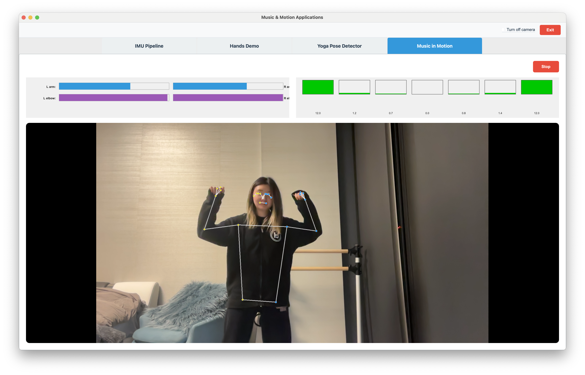

# Prototype C: Full Body Equalizer (Music in Motion)

← [MP Pipeline](MP-PIPELINE.md)

---

The **Music in Motion** tab uses MediaPipe **Pose** to drive a **7-band equalizer** on a looping audio file (e.g. `music/music.mp3`). Arm height (wrist y) controls overall gain of low and high frequency blocks; elbow bend shapes the distribution within each block and strongly boosts the extreme bands when the arms are bent. No IMU is involved — the pipeline is **camera → Pose → derived pose signals → EQ gains → audio**.

Implementation: `motion-app.py` — `BodyMotionEqualizerWidget` (Music in Motion tab).

## App overview

The Music in Motion tab provides:

- **Live camera feed** with the MediaPipe pose skeleton overlaid.
- **Control strip:** Four bars — left/right **arm height** (blue) and left/right **elbow bend** (purple). Arm bars use half width each; elbow bars sit in the second row.
- **7-band EQ display:** Gains per band (green = boost, red = cut), updated every frame from pose.
- **Audio:** Looping playback of `music/music.mp3` (or configured file) with pose-driven EQ applied in the frequency domain (FFT → per-band gain → iFFT). Output is mono duplicated to both channels.

Start/Stop starts the camera, pose processing, and audio; when the camera is off or unavailable, the bars and EQ still update from the last smoothed pose state.

## MediaPipe Pose setup

The tab uses `mp.solutions.pose.Pose` with:

- `static_image_mode=False`
- `model_complexity=1`
- `smooth_landmarks=True`
- `min_detection_confidence=0.5`, `min_tracking_confidence=0.5`

Landmarks are normalized image coordinates (0–1; y increases downward). Only a subset of landmarks is used for the equalizer (see below).

## Sensor → music pipeline (overview)

| Stage | Input | Output |
|-------|--------|--------|
| 1. Sensor | Camera frame | RGB image |
| 2. Pose | RGB frame | 33 pose landmarks (normalized x, y, z) |
| 3. Derived pose | Selected landmarks | Left/right arm height [0, 1], left/right elbow bend [0, 1] |
| 4. Smoothing | Raw derived values | Smoothed arm height and elbow bend (one-pole, α = 0.2) |
| 5. EQ mapping | Smoothed arm height + elbow bend | 7 gain values in dB (per band) |
| 6. Gain smoothing | Raw EQ gains | Smoothed gains (α = 0.15) for audio |
| 7. Audio | Looping mono buffer + smoothed gains | FFT → bin gains from band index → multiply → iFFT → clip; output to stereo stream |

The following sections describe stages 2–5 in detail.

## Stage 2: Landmarks used

Only six landmarks are read each frame:

| Landmark | Use |
|----------|-----|
| `LEFT_WRIST` | Left arm height (y), left elbow angle (with shoulder + elbow) |
| `RIGHT_WRIST` | Right arm height (y), right elbow angle |
| `LEFT_SHOULDER`, `LEFT_ELBOW` | Left elbow angle (shoulder–elbow–wrist) |
| `RIGHT_SHOULDER`, `RIGHT_ELBOW` | Right elbow angle |

All coordinates are normalized (0–1); y increases downward.

## Stage 3: Derived pose values

**Arm height (left and right)**  
- Raw value: `arm_height_raw = 1.0 - wrist.y`  
- So: wrist at top of image → 1; wrist at bottom → 0. (Raising the hand increases the value.)

**Elbow bend (left and right)**  
- Angle at elbow: angle in degrees between vectors (shoulder → elbow) and (elbow → wrist), from 2D (x, y) of the three landmarks.  
- Constants: `THETA_EXT = 165.0`° (straight arm), `THETA_BENT = 70.0`° (bent).  
- Normalize to [0, 1]:  
  `bend_raw = (THETA_EXT - angle) / (THETA_EXT - THETA_BENT)` clamped to [0, 1].  
- Then apply power curve: `bend = bend_raw ** 1.5` (more response when bent).  
- No explicit dependency on arm height; both are computed from the same landmarks.

## Stage 4: Smoothing

- **Arm height:**  
  `smoothed = 0.2 * raw + 0.8 * previous_smoothed` (same α for left and right).  
- **Elbow bend:**  
  Same one-pole smoothing with α = 0.2.  
Smoothed values are what drive the bar display and the EQ mapping.

## Stage 5: EQ mapping (pose → 7 gains in dB)

Constants: `N_BANDS_BODY = 7`, `MAX_GAIN_DB_BODY = 12.0` (±12 dB). Band edges (Hz): 20–60, 60–250, 250–500, 500–2000, 2000–4000, 4000–6000, 6000–20000. Band 3 is the mid band; bands 0–2 form the “low block”; bands 4–6 form the “high block.”

**1. Block gains from arm height**  
- `left_norm`, `right_norm` = smoothed left/right arm height clamped to [0, 1].  
- `G_left = MAX_GAIN_DB_BODY * (left_norm - 0.5) * 2` → range ±12 dB; center (0.5) = 0 dB.  
- `G_right` same for right.  
- **Low block (bands 0–2):** Gains are proportional to `G_left`, distributed by left elbow shape (see below).  
- **Mid band (3):** Fixed 0 dB.  
- **High block (bands 4–6):** Gains proportional to `G_right`, distributed by right elbow shape.

**2. Shape within each block (elbow bend)**  
- `shape_left = (left_elbow_bend - 0.5) * 2` in [-1, 1]; same for `shape_right`.  
- Each 3-band block has weights `w_edge`, `w_center`, and a fixed 0.6. `w_edge = 0.6 + 0.8 * |shape|`; `w_center = 1.0`.  
- If shape ≥ 0: more weight on one edge (e.g. low block: band 0; high block: band 6). If shape < 0: more weight on the other edge. Weights are normalized so the block’s total gain still follows `G_left` or `G_right`.  
- So elbow bend **redistributes** the block gain across the three bands (edge vs center).

**3. Elbow boost (strong effect on extreme bands)**  
- When elbow bend > 0.5: `elbow_scale = (elbow_bend - 0.5) * 4` capped at 1 (so at ~75% bend, scale ≈ 1).  
- **Band 0:** `gain[0] = G_left * w0 + elbow_scale_left * MAX_GAIN_DB_BODY`.  
- **Band 6:** `gain[6] = G_right * w6 + elbow_scale_right * MAX_GAIN_DB_BODY`.  
- So when the elbow bars are above 50%, the lowest and highest bands are pushed toward ±12 dB (dominant effect on extremes).

**4. Clamp**  
- All 7 gains are clamped to `[-MAX_GAIN_DB_BODY, +MAX_GAIN_DB_BODY]`.

These gains are stored as `_current_gains_db` and drawn in the EQ bar widget.

## Stage 6–7: Audio path

- **Playback:** A mono buffer (e.g. `music/music.mp3` loaded with librosa at 44.1 kHz) is played in a loop.  
- **Block size:** `BODY_AUDIO_BLOCK_SIZE = 2048` (same as IMU Proto G).  
- **Per-block EQ:** For each block of 2048 samples:  
  - Copy current pose-derived gains; smooth them with `BODY_EQ_SMOOTHING_ALPHA = 0.15`.  
  - Convert gains dB → linear: `gains_lin = 10^(gains_db/20)`.  
  - Precomputed `_band_index` maps each FFT bin (rfft of block) to a band index 0–6.  
  - `bin_gains = gains_lin[band_index]`; multiply FFT spectrum by `bin_gains`; iFFT; clip to ±1.  
- **Output:** Stereo stream (same signal on L and R) via sounddevice `OutputStream` with the above callback.

So the **sensor → music** path is: **Camera → Pose landmarks → wrist y (arm height) + shoulder–elbow–wrist angles (elbow bend) → smoothed pose → 7-band EQ gains → smoothed gains → FFT/bin gain/iFFT on looping audio → stereo out.**

## UI summary

- **Top:** Start / Stop button.  
- **Control strip:** L arm, R arm (blue); L elbow, R elbow (purple).  
- **EQ bars:** Seven bars with current gain in dB (green = boost, red = cut).  
- **Video:** Camera feed with pose skeleton; or black if camera off/blackout.
