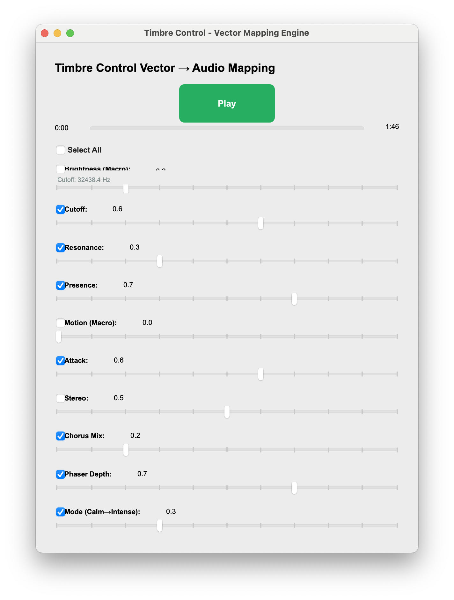

# Prototype A: Timbre Control Vector 1

← [SF Pipeline](SF-PIPELINE.md)



---

## Objective

Design a generalized timbre engine with a scalable control vector and modular DSP mapping.

This prototype focused on architecture rather than musical control.

- Audio: Same kind of processing (low‑pass, resonance, presence, chorus, phaser, pan) but all driven from one dataclass.

- UI: 10 sliders (brightness, cutoff, resonance, presence, motion, attack, stereo, chorus, phaser, mode), each with an enable checkbox. No video, no sensors.

- Use case: Design and test how many parameters (including a “motion” macro) can drive timbre from sliders only.

---

## Core Architecture

```python
apply_timbre_controls(ctrl: TimbreControls, audio_state: AudioState)
```

This function was the ONLY translation layer between:

Control Vector → DSP Parameters

## DSP Modules Included

- Low-pass filter
- Resonance (Q)
- High-shelf presence filter
- Chorus
- Phaser
- Stereo pan
- Motion macro
- Mode macro

## Brightness Macro

The Brightness moved multiple parameters simultaneously:
- Multiplied cutoff
- Slightly boosted Q

Eample:

```
brightness_cutoff = exp(lerp(log(f_min), log(f_max), brightness))
cutoff_hz *= lerp(0.5, 1.5, brightness)
Q *= lerp(1.0, 1.2, brightness)
```

## Motion Macro

Motion gated modulation depth:
```
mod_intensity = clamp01(V_motion)
chorus_mix = lerp(0.0, 0.7, V_chorus_mix * mod_intensity)

## Resonance Mapping
𝑄 = 0.7 + (8.0 − 0.7) ⋅ (𝑉𝑟𝑒𝑠𝑜𝑛𝑎𝑛𝑐𝑒^1.8)

Attack macro:

Q=Q⋅(1+0.5𝑉𝑎𝑡𝑡𝑎𝑐𝑘)


## Key Innovation

- Enable/disable flags for each dimension
- Mandatory smoothing for all DSP parameters
- Strict decoupling from UI sliders

## Limitation
- Too many dimensions at once made motion mapping unclear and difficult to debug.

