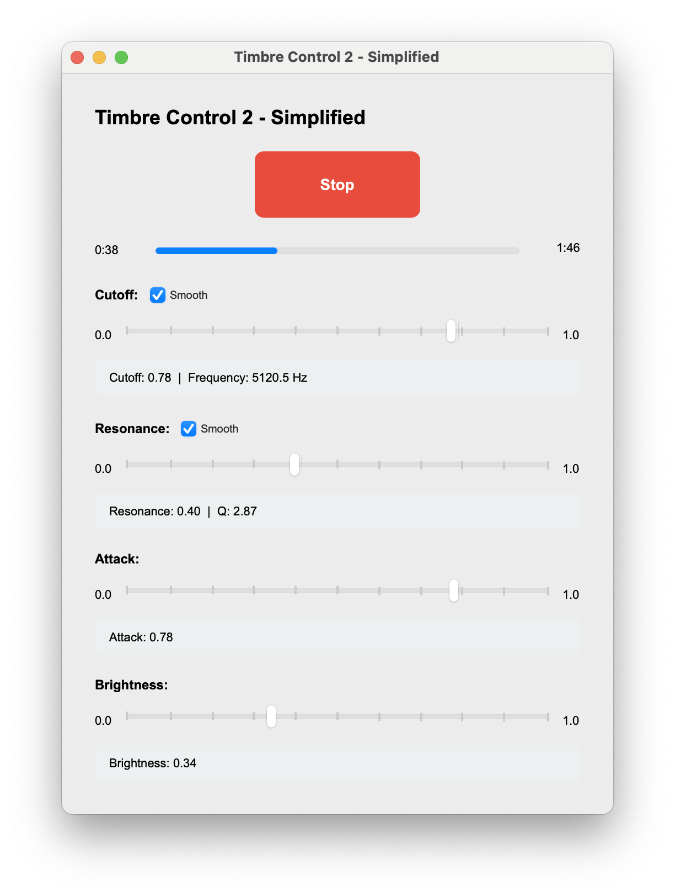

# Prototype B: Timbre Control Vector 2

← [SF Pipeline](SF-PIPELINE.md)



---

## Objective

Strip the system down to a musically stable, perceptually strong timbre core.

- Audio: Same biquad low‑pass (and mapping) as in timbre-test; plays music.mp3.

- UI: 4 sliders only: cutoff, resonance, attack, brightness. Decoupled: the audio callback only reads a TimbreControls object (V_cutoff, V_resonance, V_attack, V_brightness), not the UI.

- Use case: Minimal, clean “sliders → timbre” app with no vision or sensors.

---

## Control Vector Philosophy

All expressive dimensions were normalized:

```python
@dataclass
class TimbreControls:
    V_cutoff: float        # 0–1
    V_resonance: float     # 0–1
    V_attack: float        # 0–1
    V_brightness: float    # 0–1
    V_tremolo: float       # 0–1
    V_mode: float          # 0–1
    V_volume: float        # 0–1
```

---

## Core DSP

Biquad Low-Pass Filter (RBJ Cookbook form):

```
w  = 2π·f_c / f_s
k  = tan(w/2)
norm = 1 / (1 + k/Q + k²)

b_0 = k² · norm
b_1 = 2·b_0
b_2 = b_0
a_1 = 2·(k² − 1)·norm
a_2 = (1 − k/Q + k²)·norm
```

---

## Asymmetric Smoothing

Cutoff smoothing:

- 8ms when increasing
- 40ms when decreasing


 
## Why This Prototype Mattered

This version:
- Eliminated instability
- Reduced feature noise
- Matched perceptual expectation
- Created a reliable musical core

It became the stable foundation for motion integration.