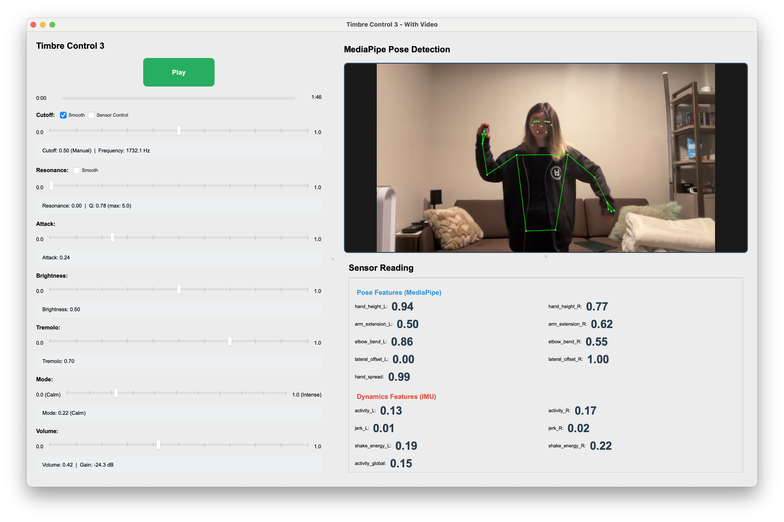

# Prototype C: Timbre Control Vector 3

← [SF Pipeline](SF-PIPELINE.md)



---

## Objective

Building on the foundation of Prototype B, Prototype C integrates MediaPipe pose detection + IMU sensors to create a real-time motion-controlled musical instrument.

- Audio: Same core as timbre-control2 (low‑pass, resonance, etc.) plus tremolo, mode, and volume; uses TimbreControls (including V_tremolo, V_mode, V_volume).

- UI: Split layout: one side = camera + MediaPipe pose, other side = sliders/controls. Uses MotionFeatureExtractor / MotionState from motion_fusion to turn pose (e.g. hand height, arm extension) into features that can drive timbre.

- Use case: “Sensor-to-music” pipeline: timbre can be driven by body motion (vision) or by sliders; the version that ties together vision and timbre control.

## Motion Pipeline

Camera → MediaPipe → MotionFeatureExtractor → MotionState → TimbreControls → Audio

---

## Atomic Snapshot Pattern

To prevent race conditions between UI thread and audio thread:

```python
new_ctrl = TimbreControls(...)
self.ctrl_snapshot = new_ctrl
```

Audio thread reads ONLY from:

```python
ctrl = self.ctrl_snapshot
```

## Motion Features

Examples from MotionState:

- `hand_height_L` / `hand_height_R`
- `arm_extension_L` / `arm_extension_R`
- `elbow_bend_L` / `elbow_bend_R`
- `hand_spread`
- `activity_L` / `activity_R`
- `jerk_L` / `jerk_R`
- `shake_energy_L` / `shake_energy_R`
- `mediapipe_confidence`
- `imu_confidence_L` / `imu_confidence_R`

## Two-Stage Sensor Smoothing

**Stage 1 — Median-of-3:**

```text
median = sorted(history)[1]
```

**Stage 2 — Two-speed one-pole:**

```text
y = y + α(x − y)
```

- Fast rise (α larger)
- Slow fall (α smaller)

## Tremolo Mapping

```text
depth = 0.8 · V_tremolo
```

- **Intense mode:** `rate = 1 + 7 · V_tremolo`
- **Calm mode:** `rate = 1 + 3 · V_tremolo`

## Volume Mapping (Perceptual Curve)

```text
gain_db = −30 + (V_volume^1.8) · 27
gain_linear = 10^(gain_db / 20)
```

With asymmetric smoothing: 50 ms attack, 300 ms release.

## Final Result

Prototype 3 transformed the system from:

Filter demo → Gesture-controlled digital instrument

It introduced:
- Full-body control
- Confidence-aware decay
- IMU + vision fusion
- Real-time expressive mapping
- Performance-ready architecture
